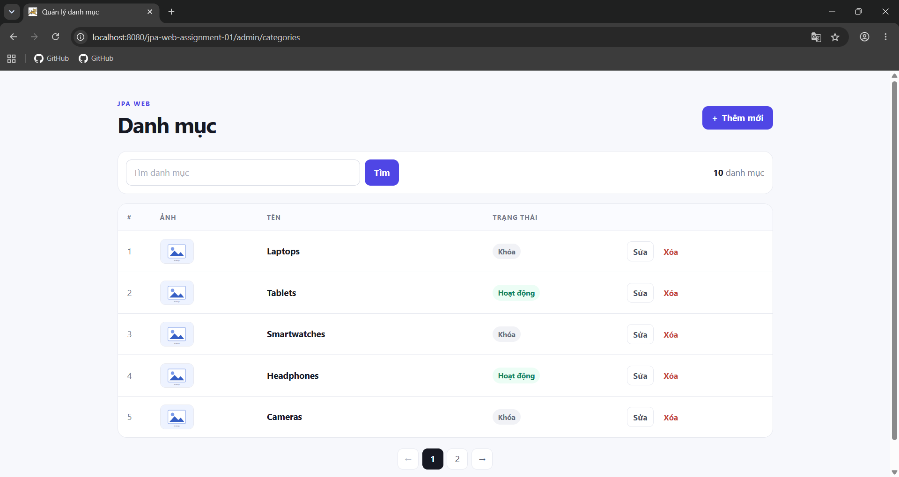
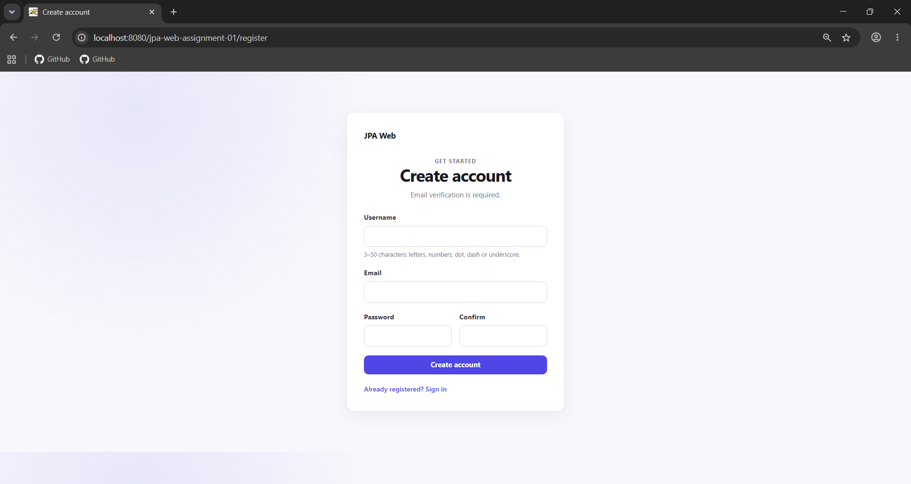
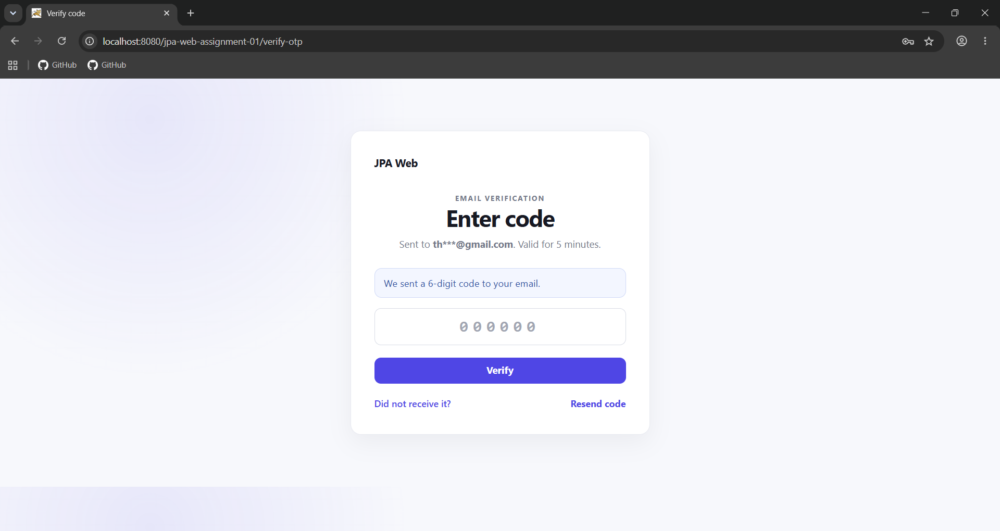
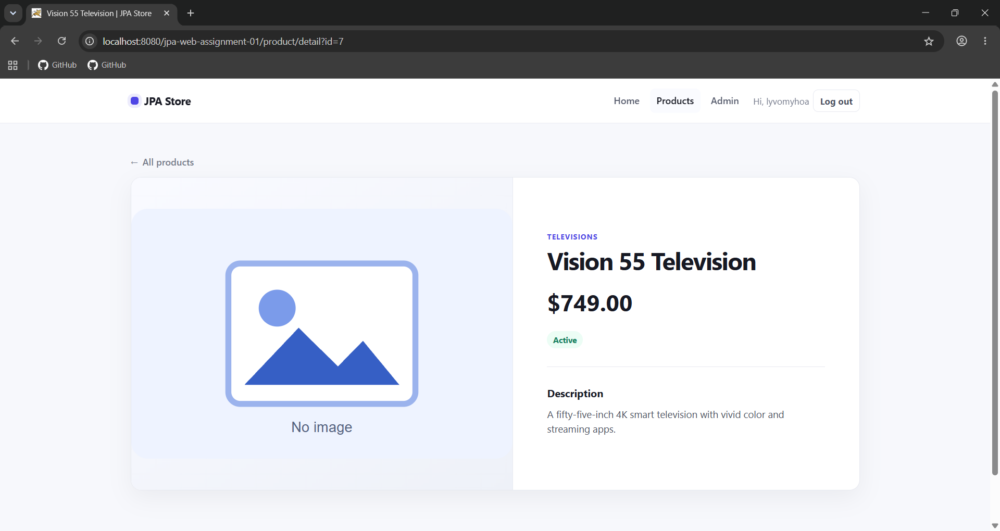
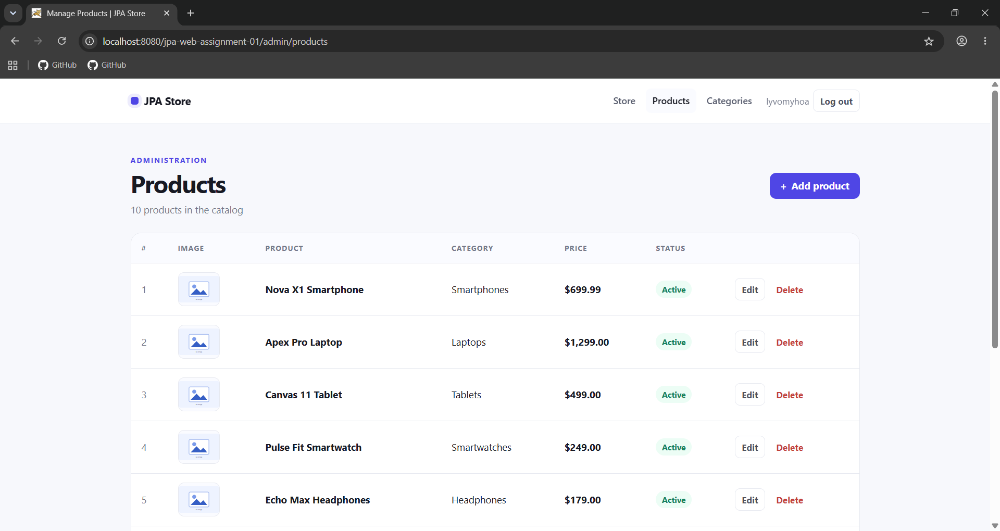
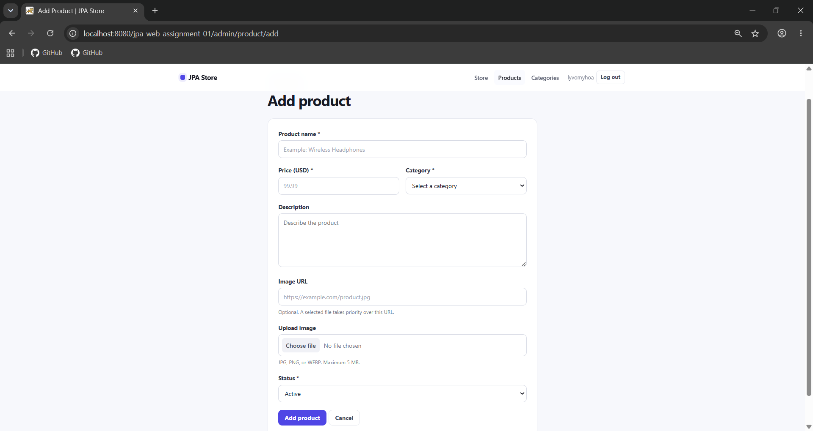
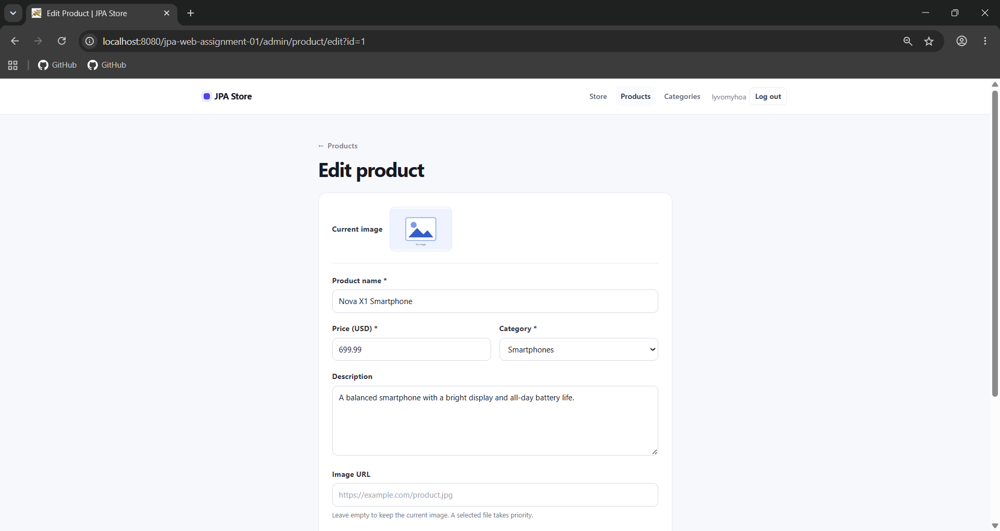

# JPA Web Assignment 02

> Student: Ly Vo My Hoa - 24133017

This repository extends the existing Assignment 01 project. It keeps the same
WAR, package name, Tomcat context path, and layered architecture:

```text
Controller -> Service -> DAO -> JPA/Hibernate -> MySQL
```

No Spring, Spring Boot, `javax.*`, or JDBC CRUD is used.

## Features

- Assignment 01 Category CRUD remains available.
- Registration with a six-digit email OTP and account activation.
- Login by username or email, session authentication, and logout.
- Password reset with a purpose-specific email OTP.
- BCrypt password and OTP hashing.
- Product CRUD with a required Category relationship.
- Ten newest products on the home page.
- Public product list with six products per page.
- Public product detail page.

## Requirements

- Windows 10 or 11
- JDK 24 or newer (`JAVA_HOME` is required)
- Apache Tomcat 10.1.x installed as the `Tomcat10` Windows service
- MySQL Server 8.x and `mysql.exe` on `PATH`
- Git
- Gmail account with 2-Step Verification and an App Password for real OTP email

The Maven Wrapper is included, so a separate Maven installation is optional.

## Environment checks

Run in PowerShell from the repository root:

```powershell
git --version
java -version
& "$env:JAVA_HOME\bin\javac.exe" -version
& "$env:CATALINA_HOME\bin\version.bat"
mysql --version
Get-Service MySQL*
Get-Service Tomcat10
$env:JAVA_HOME
$env:CATALINA_HOME
.\mvnw.cmd -version
```

The project emits Java 24 bytecode. A newer JDK may build and run it when it can
target Java 24.

## Gmail OTP configuration

Do not put a Gmail password or App Password in source, XML, SQL, or Git. Open
PowerShell as Administrator and set Machine-level variables:

```powershell
[Environment]::SetEnvironmentVariable("JPAWEB_MAIL_USERNAME", "sender@gmail.com", "Machine")
[Environment]::SetEnvironmentVariable("JPAWEB_MAIL_APP_PASSWORD", "your-16-character-app-password", "Machine")
Restart-Service Tomcat10
```

`JPAWEB_MAIL_USERNAME` is also the From address. SMTP defaults to
`smtp.gmail.com:587` with authentication and STARTTLS. See [setup.md](setup.md)
for full setup and the JVM property option.

## Database

Default local settings:

```text
Database: jpa_web
Host: localhost:3306
Username: root
Password: 123456
```

`database.sql` preserves or creates `categories`, `videos`, `users`,
`otp_tokens`, and `products`. It inserts ten English categories and ten English
products idempotently. Product seeds resolve Category IDs by name.

## Build and run

Build only:

```powershell
mvn clean package
```

Use `.\mvnw.cmd clean package` when Maven is not installed. Expected artifact:
`target/jpa-web-assignment-01.war`.

To initialize MySQL, build, deploy to Tomcat, and open the application, run
Administrator PowerShell:

```powershell
.\run.cmd
```

The runner checks JDK 24+, MySQL, and Tomcat. It warns when Gmail variables are
missing without printing any secret.

Base URL: <http://localhost:8080/jpa-web-assignment-01/>

## URLs

### Public and authentication

- Home: <http://localhost:8080/jpa-web-assignment-01/>
- Products: <http://localhost:8080/jpa-web-assignment-01/product?page=1>
- Product detail: <http://localhost:8080/jpa-web-assignment-01/product/detail?id=1>
- Register: <http://localhost:8080/jpa-web-assignment-01/register>
- Verify OTP: <http://localhost:8080/jpa-web-assignment-01/verify-otp>
- Login: <http://localhost:8080/jpa-web-assignment-01/login>
- Logout: `POST /logout` from the signed-in navigation form
- Forgot password: <http://localhost:8080/jpa-web-assignment-01/forgot-password>
- Reset password: <http://localhost:8080/jpa-web-assignment-01/reset-password>

### Admin

- Category list: <http://localhost:8080/jpa-web-assignment-01/admin/categories>
- Add Category: <http://localhost:8080/jpa-web-assignment-01/admin/category/add>
- Product list: <http://localhost:8080/jpa-web-assignment-01/admin/products>
- Add Product: <http://localhost:8080/jpa-web-assignment-01/admin/product/add>

Admin URLs require an active logged-in account.

## Recommended test order

1. Run `run.cmd`; confirm the home page shows the ten newest products.
2. Open `/product?page=1`; verify six cards and Previous/Next navigation.
3. Open a product detail link.
4. Register with a real email, enter the received OTP, and log in.
5. Log out and confirm an admin URL redirects to login.
6. Reset the password by email OTP and log in with the new password.
7. Test Product add, list, edit, detail/find, delete, and Category selection.
8. Recheck Assignment 01 Category list, filter, add, and edit.

## Screenshots

Existing Assignment 01 evidence:




Add screenshots with these filenames, then remove the HTML comments.

### Assignment 02 home

> Placeholder: home page with the ten newest products.

<!--  -->

### Registration and OTP

> Placeholder: registration and OTP verification.

<!--  -->
<!--  -->

### Product list and detail

> Placeholder: pages 1 and 2 plus Product detail.

<!--  -->
<!--  -->
<!--  -->

### Product administration

> Placeholder: Product list, add, and edit.

<!--  -->
<!--  -->
<!--  -->

## Notes

- OTP lifetime is five minutes and each token is purpose-specific.
- Passwords and OTP codes are never stored as plaintext.
- Missing or rejected Gmail credentials do not block deployment, but OTP email
  delivery cannot complete until valid credentials are supplied.
- Runtime uploads remain outside the WAR through `JPAWEB_UPLOAD_DIR`.
